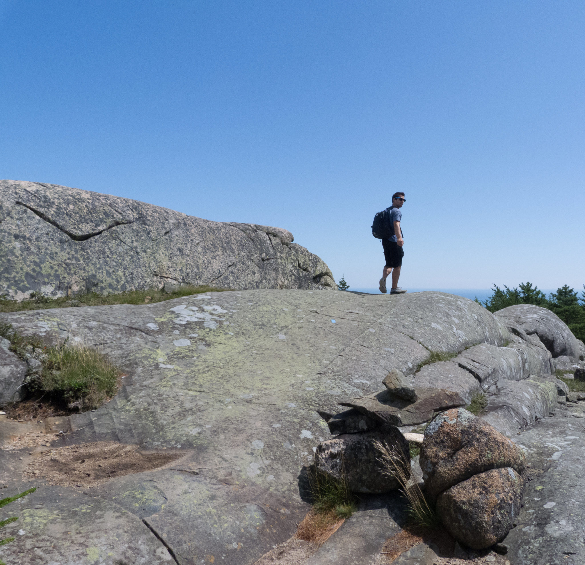

# Tom Ayotte's portfolio website
TL;DR I enjoy being creative in all aspects of life. I believe the way to be creative is to have as many experiences to draw from as possible. Therefore, I try to learn and do as many things as I can which leads me to have many hobbies that I enjoy such as: engineering projects, rock climbing, guitar, drums, music, cooking, traveling, photography, etc. My friends and especially my family have inspired and encouraged me my whole life and I cannot thank them enough. Finally, whoever you are, enjoy life as much as you can.

Checkout more details of my projects by clicking the image below!

###### Template credit to: [shihabiiuc](https://github.com/shihabiiuc/animated-portfolio)